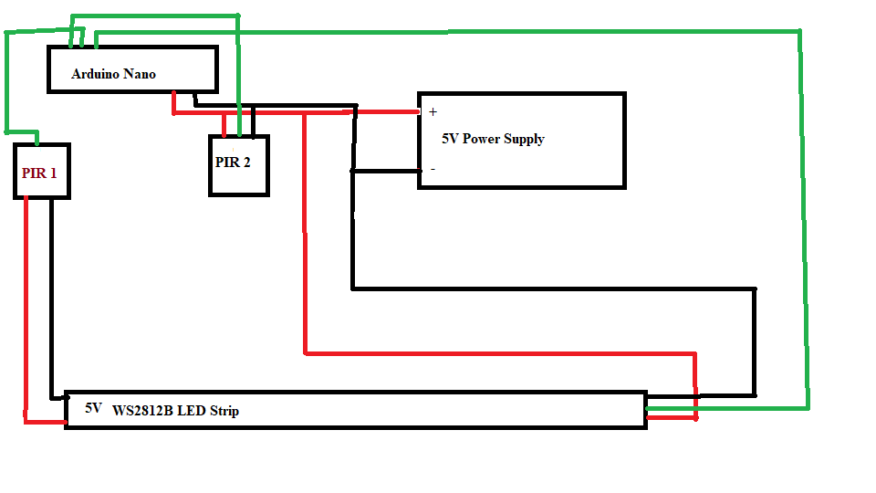

# Directional-LED-Hall-lights
Lights based on up or down.....directional

Materials list:

5V Power supply -> https://www.amazon.com/ALITOVE-Converter-100-240V-Transformer-5-5x2-5mm/dp/B0852HL336/ref=sr_1_4?crid=KDC5VEEB7MHQ&dchild=1&keywords=5v+power+supply&qid=1630206460&sprefix=5v+power+%2Caps%2C194&sr=8-4

(ANY 5v supply will work providing it has enough power)

5V LED lights -> https://www.amazon.com/gp/product/B01CDTEJBG/ref=ppx_yo_dt_b_asin_title_o01_s02?ie=UTF8&psc=1

LED channel -> https://www.amazon.com/gp/product/B01M09PBYX/ref=ppx_yo_dt_b_asin_title_o00_s00?ie=UTF8&psc=1

PIR Sensors -> https://www.amazon.com/gp/product/B012ZZ4LPM/ref=ppx_yo_dt_b_asin_title_o02_s00?ie=UTF8&psc=1

Arduino Nano -> https://www.amazon.com/Arduino-A000005-ARDUINO-Nano/dp/B0097AU5OU/ref=sr_1_3?dchild=1&keywords=arduino+nano&qid=1630206361&sr=8-3
(You can buy a generic version of a nano, it will work, I just happen to have one on hand)

Misc wire.

You will also need a 'project box' of some kind.  I just went to a free 3d print site and made my own.  You can also just buy them on Amazon.

**JUST REMEMBER

TRY to keep wires apart.  Power wires over top of signal wires can cause issues.  Lights coming on, or script caught in loop...etc.

 

Click on image below to see video

##Things you can change 

#define NUM_LEDS 180           // number of leds, be careful use too many can have adverse results
#define LED_DATA_PIN 9         // data pin from led light strip
#define LEDS_PER_STAIR 20      
// Number of Leds per stair, number that comes on at once basically.  Easy to keep is divisble with your NUM_LEDS for best effect.  Odd numbers do not work well
 
int onTime = 20*1000;               // 20 seconds how long they stay on
int MOTION_LEFT = 10;            // pin number on Nano
int MOTION_RIGHT = 11;           // pin number on Nano
int fadeTimeDiff = 20;          

Simple sketch to add lights to my hallway.   Works in either direction, depending on which direction you're coming from.

Modified sketch from this project -> https://www.youtube.com/watch?v=nd3-q7_o6bg

